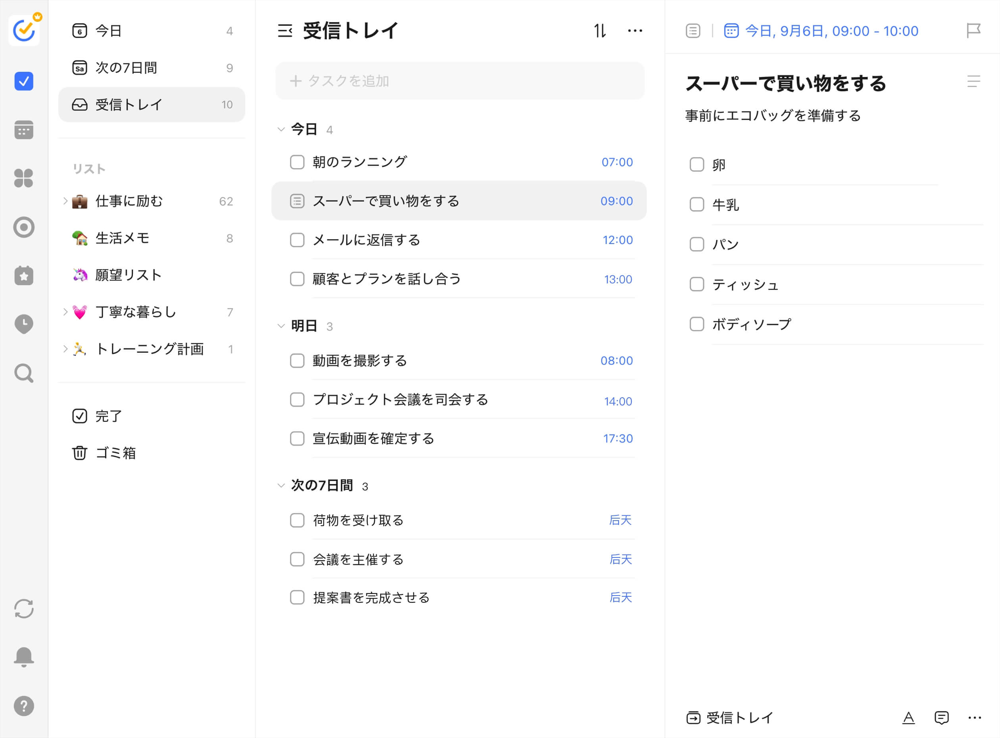
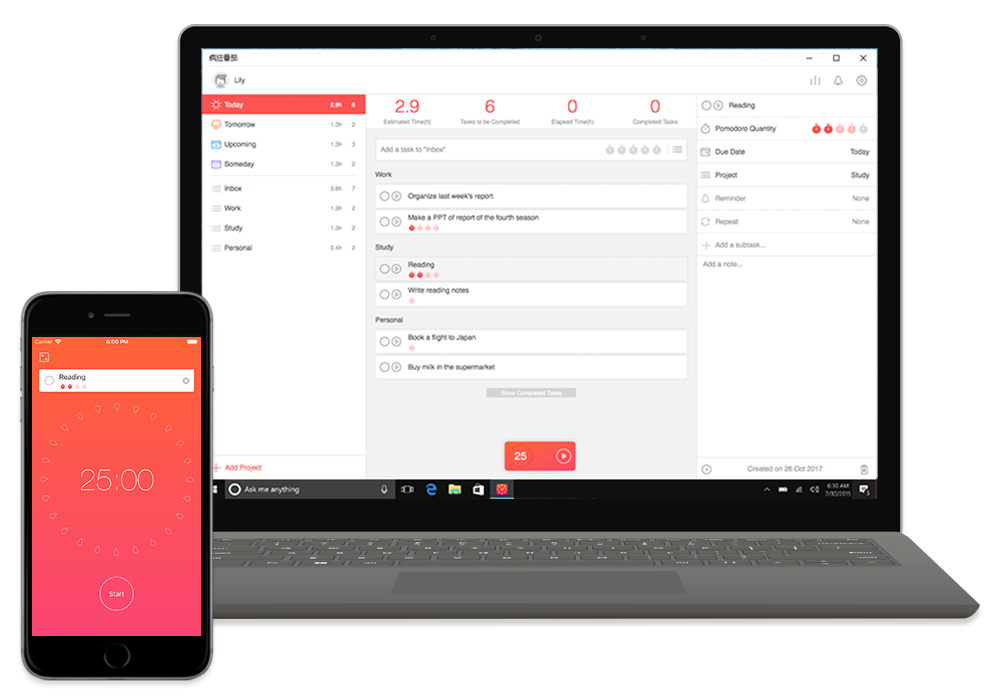

# マーケットリサーチ：DAILY FOCUS

作成日：2026-04-13

作成者：亀山 雄介

## 目次
1. 3C分析
2. SWOT分析
3. STP分析
4. 4P / 4C 分析
5. 競合サイト分析

---

## 1. 3C分析

### Customer（顧客）
#### ターゲット顧客の特徴・ニーズ・行動パターン
- **特徴**
  - 20〜40代の知的労働者（リモート/ハイブリッド比率が高い）
  - 学習者（資格/語学/プログラミング）で、日々の継続が課題
  - タスク管理ツールは使っているが「増えすぎて見ない」状態になりがち
- **ニーズ/悩み**
  - 重要タスクに着手できない（優先順位が決められない）
  - 通知・会議・マルチタスクで集中が分断される
  - 1日の終わりに「やった感」が残らず、継続しにくい
- **行動パターン**
  - 情報収集：YouTube/ブログ/SNS、App Store、Notionテンプレ検索
  - 購買行動：無料→トライアル→月額課金（継続価値が明確なら課金）
  - 習慣化：最初は意欲的だが、入力や設定が重いと離脱
- **市場トレンド（定性的）**
  - 「深い集中」「ミニマル運用」「習慣化」「ジャーナリング」の文脈が拡大
  - 高機能ToDoの反動として、軽量・目的特化ツールへの回帰
- **市場規模の参考値**
  - グローバルの Task Management Software 市場は **2018年 17.13億米ドル**、**2026年 45.36億米ドル** 見込み、**2019〜2026年 CAGR 13.3%**
  - 北米の Task Management Software 市場は **2018年 5.784億米ドル**、**2026年 14.06億米ドル** 見込み
  - 北米が最大シェア市場とされており、個人・チーム双方のタスク管理需要が継続している
  - DAILY FOCUS は ToDoアプリと集中支援アプリの中間に位置するため、この数値は ToDo寄り市場の参考値として扱う

### Competitor（競合）
#### 競合サービスの特徴・強み・弱み

1) **高機能ToDo（例：Todoist / TickTick 等）**
- **特徴**：プロジェクト/優先度/フィルタ等で管理を最適化
- **強み**：網羅性、連携、継続利用者が多い
- **弱み**：整理に時間を使いやすい／実行（集中）に繋がらない場合がある
- **差別化余地**：DAILY FOCUS は「今日の最重要1つ」に絞る体験を強化

2) **フォーカスタイマー/ポモドーロ（例：Focus To-Do / Forest 等）**
- **特徴**：集中時間の確保と可視化に強い
- **強み**：開始が簡単、成果（時間）が見えやすい
- **弱み**：何に集中するかの意思決定支援が弱い／振り返りが薄い
- **差別化余地**：決める→集中→振り返るを一体化

3) **日次計画/スケジュール自動化（例：Sunsama / Motion 等）**
- **特徴**：日次計画・時間ブロッキング・自動スケジュール
- **強み**：仕事の見通しと実行計画が立つ
- **弱み**：高価格帯になりがち／設定・入力の学習コスト
- **差別化余地**：ミニマルで低摩擦、個人の「今日」に特化

### Company（自社）
#### DAILY FOCUS の強み・提供価値
- **提供できる価値**
  - 1日の意思決定を減らし、重要タスクの実行確率を上げる
  - 集中セッションを習慣化し、達成感と改善を積み上げる
- **独自の強み**
  - 「今日の最重要1つ」中心の体験設計（タスク肥大化の抑制）
  - 1画面導線で実行まで迷わせない（開始摩擦の最小化）
  - ログ/振り返りを軽量化しつつ、分析で自己理解を促進
- **活用できるリソース**
  - Next.js/TypeScript による迅速な実装と反復
  - UIコンポーネントの再利用性（Tailwind運用）
- **弱み・課題**
  - 実績（ユーザー/データ）が初期は少なく、説得力が弱い
  - 競合の機能幅に対して「不足」と見られるリスク

---

## 2. SWOT分析

|  | プラス要因 | マイナス要因 |
| --- | --- | --- |
| 内部環境 | **Strengths（強み）** - 「最重要1つ」への集中を促す明確な価値提案 - 低摩擦なUX（決める→集中→振り返る） - ログが残り、改善サイクルを作れる | **Weaknesses（弱み）** - 初期は機能が薄く見える可能性 - 競合に比べブランド/信頼が不足 - 継続価値（習慣化）の説明が難しい場合がある |
| 外部環境 | **Opportunities（機会）** - リモート普及による集中ニーズ増 - 習慣化/ジャーナリングの需要拡大 - 高機能ToDo疲れによるミニマル回帰 | **Threats（脅威）** - 既存大手の機能追加/類似機能の実装 - 無料のタイマー/ToDoの代替が多い - ユーザーの「継続できない」構造的課題 |

---

## 3. STP分析

### Segmentation（市場細分化）
- **地理的変数**：都市部（通勤/混在）・地方（在宅中心）、国内/海外
- **人口統計的変数**：学生/社会人、職種（エンジニア・企画・営業など）、年収帯
- **心理的変数**：自己成長志向、ミニマリズム志向、成果を可視化したい志向
- **行動変数**：ToDo利用者、タイマー利用者、週次レビューをする層、課金経験の有無

### Targeting（ターゲット選定）
- **狙うセグメント（優先）**
  1. タスクは多いが、重要タスクの実行に課題がある知的労働者（20〜40代）
  2. 学習継続に課題がある学習者（資格/語学/プログラミング）
- **選定理由**
  - 「優先順位付け」と「集中の確保」という痛みが明確
  - 習慣化ツールに抵抗が少なく、継続価値で課金の可能性がある
- **市場規模（推定）**
  - DAILY FOCUS 単独の公開市場データは確認できていない
  - ToDoアプリに近い Task Management Software 市場は **2018年 17.13億米ドル**、**2026年 45.36億米ドル** 見込み
  - 北米市場は **2018年 5.784億米ドル**、**2026年 14.06億米ドル** 見込みで、主要需要地域として位置づけられる
  - DAILY FOCUS はタスク管理に加えて集中支援と振り返り機能を持つため、実際の提供価値は ToDoアプリ市場よりやや広い
  - 少なくとも ToDo/タスク管理領域は成長市場であり、新規参入の余地があると判断できる

### Positioning（ポジショニング）
- **差別化軸**
  1. 機能の網羅性（低←→高）
  2. 実行（集中）への導線（弱←→強）
- **位置づけ**
  - 高機能ToDoより網羅性は低いが、実行導線は強い
  - 単体タイマーよりも、意思決定（今日の焦点）と振り返りが厚い
- **理由**
  - 「管理」より「実行成果」にコミットすることで、差別化と継続価値を作れる

---

## 4. 4P / 4C 分析

| 4P（売り手視点） | 内容 | 4C（買い手視点） | 内容 |
| --- | --- | --- | --- |
| Product（製品） | 今日のフォーカス設定、集中タイマー、実行ログ、短い振り返り、インサイト | Customer Value（顧客価値） | 重要タスクの実行確率UP、集中の確保、達成感の蓄積 |
| Price（価格） | フリーミアム（無料＋Pro月額） | Cost（顧客コスト） | 支払い＋学習コスト＋入力負荷（低摩擦で低減） |
| Place（流通） | Webアプリ（PC中心）＋将来モバイル | Convenience（利便性） | ブラウザで即開始、デバイス跨ぎで継続 |
| Promotion（販促） | 生産性/習慣化のコンテンツ、テンプレ、SNS、コミュニティ | Communication（対話） | フィードバック受付、改善ログの公開、オンボーディングの対話設計 |

---

## 5. 競合サイト分析

### 競合サイト 1
- **サイト名**：TickTick
- **URL**：https://ticktick.com/
- **スクリーンショット**：
- **分析**
  - 第一印象：ミニマルでシンプルなデザインでありながら洗練された印象があり、直感的に使えそうな安心感がある。
  - 良い点（デザイン・機能・コンテンツ）：全体の情報設計が整理されており、見た目もおしゃれで、初めて利用するユーザーでも使い勝手の良さを想像しやすい。
  - 改善できそうな点：予定管理の導線については、ドラッグアンドドロップによる操作性がより前面に出ると、さらに直感的なサービスとして伝わりやすいと考えられる。
  - 取り入れたい要素：ミニマルでシンプルなUI、洗練されたビジュアル、そして「使いやすそう」と感じさせる第一印象の作り方は取り入れたい。

### 競合サイト 2
- **サイト名**：Sunsama
- **URL**：https://www.sunsama.com/a
- **スクリーンショット**：
- **分析**
  - 第一印象：自分がイメージしていたサービス像に非常に近く、落ち着いた雰囲気の中で日々の計画と実行を整理できそうな印象を受けた。
  - 良い点（デザイン・機能・コンテンツ）：ドラッグアンドドロップで予定やタスクを直感的に調整できそうな点が魅力的である。また、画面全体が整理されていて視認性が高く、日次計画に集中しやすい構成になっている点も良い。さらに、情報量を抑えつつ必要な機能が分かりやすく伝わるため、初見でも利用イメージを持ちやすい。
  - 改善できそうな点：日本人ユーザー向けに、表現や導線、ローカライズの面でさらに最適化できる余地があると考えられる。
  - 取り入れたい要素：ドラッグアンドドロップ操作をより積極的に取り入れ、視覚的にも分かりやすい工夫を加えることで、直感的に使える体験を強化したい。

### 競合サイト 3
- **サイト名**：Focus To-Do
- **URL**：https://www.focustodo.cn/
- **スクリーンショット**：
- **分析**
  - 第一印象：DAILY FOCUS が目指す方向性と近い印象があり、タスク管理と集中支援をシンプルにまとめたサービスだと感じた。
  - 良い点（デザイン・機能・コンテンツ）：全体的にシンプルで分かりやすく、機能の役割が直感的に伝わる点が良い。
  - 改善できそうな点：機能面は分かりやすい一方で、デザイン面はさらに洗練させる余地があると感じた。
  - 取り入れたい要素：必要な情報を絞ったシンプルな構成は、DAILY FOCUS にも取り入れたい。

---

## 6. 参考文献

- Fortune Business Insights, Task Management Software Market, 2019-2026
- TickTick 公式サイト https://ticktick.com/
- Sunsama 公式サイト https://www.sunsama.com/a
- Focus To-Do 公式サイト https://www.focustodo.cn/
